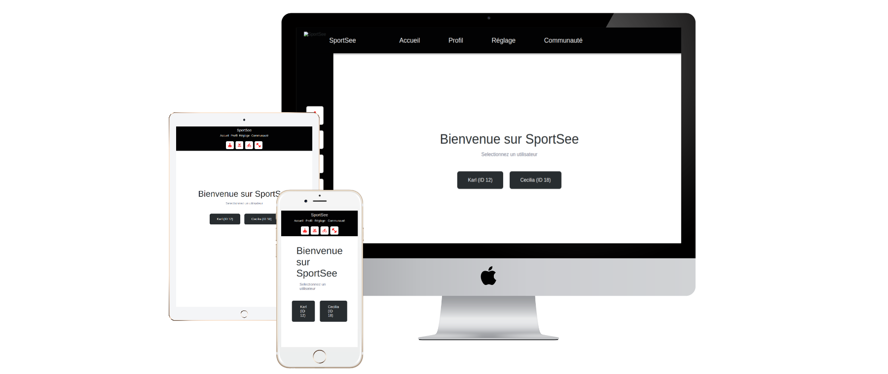

<h1 align="center">SportSee — User Profile Dashboard</h1>

<p align="center"><strong>Languages:</strong> <a href="README.md">Français</a> | <a href="README.en.md">English</a></p>

<p align="center">
  <a href="https://react.dev"></a>
  <a href="https://www.typescriptlang.org"></a>
  <a href="https://nodejs.org"></a>
  <a href="https://pnpm.io"></a>
  <a href="https://vitejs.dev"></a>
  <a href="https://recharts.org"></a>
  <a href="./public/mockup"></a>
  <a href="LICENSE"></a>
  <a href="https://github.com"></a>
</p>

<p align="center">
  
</p>

## 📋 Overview

SportSee is a responsive fitness tracking dashboard that displays user activity, performance metrics, and key health indicators. Built with **React + TypeScript**, it features real-time data fetching from a Node.js backend API.

### Current Scope

- ✅ Desktop layout (1024x780px minimum)
- ✅ 15 implemented user stories
- ✅ Mobile & tablet adaptations (768px / 420px breakpoints)

## 🚀 Getting Started

### Prerequisites

- Node.js 20+ and [pnpm](https://pnpm.io) 10 (`corepack enable`)
- Backend API running (see `/Backend` folder) when `VITE_USE_API=true`

### Installation

```bash
# Install dependencies
pnpm install

# Start development server
pnpm dev

# Start frontend + backend together
pnpm dev:all

# Build for production
pnpm build

# Preview production build
pnpm preview

# Run linting
pnpm lint
```

## 📁 Project Structure

```
src/
├── components/          # Reusable React components
│   ├── Charts/         # Chart components (BarChart, LineChart, RadarChart, RadialChart)
│   ├── Layout/         # Navigation and page layout
│   └── MetricCard/     # Key metrics display cards
├── pages/              # Page-level components
│   ├── Home/
│   └── Profile/        # Main dashboard page
├── client/             # API client services
│   ├── apiClient.ts    # HTTP client using Axios
│   ├── mockClient.ts   # Mock data for development
│   └── builders.ts     # Data transformation builders
├── data/               # Mock data
├── loaders/            # React Router loaders for data fetching
├── types/              # TypeScript type definitions
├── constants/          # App constants
└── helpers/            # Utility functions
```

## 🎯 Key Features (15 User Stories)

### Layout & Navigation

- **US#1**: Horizontal navigation bar with links (Accueil, Profil, Réglage, Communauté)
- **US#2**: Vertical icon sidebar with activity type buttons
- **US#3**: Desktop-optimized layout (1024x780px minimum)

### User Dashboard

- **US#4**: Personalized greeting with user's first name
- **US#5**: User information from `/user/:id` endpoint
- **US#10**: Key metrics cards (Calories, Proteins, Carbs, Fats)

### Data Fetching

- **US#6**: Daily activity data from `/user/:id/activity`
- **US#7**: Average session duration from `/user/:id/average-sessions`
- **US#8**: Daily score completion from `/user/:id`
- **US#9**: Performance metrics from `/user/:id/performance`

### Charts & Visualizations

- **US#11**: BarChart — Daily activity (weight & calories)
- **US#12**: LineChart — Average session duration trend
- **US#13**: RadarChart — Performance by activity type
- **US#14**: RadialBarChart — Daily objective completion score
- **US#15**: Metric cards — Key health figures with icons

## 📚 Documentation

**[View Complete API Documentation →](https://steinshy.github.io/OC-SportSee/jdocs/)**
Generated with [TypeDoc](https://typedoc.org/) via `pnpm docs` (the `docs/` folder is not versioned; CI publishes it under `/jdocs`)

## 🔌 API Integration

### Data Sources

The application fetches data from 4 main endpoints:

```typescript
// User information
GET /user/:id
→ Returns: userInfos, score/todayScore, keyData

// Daily activity
GET /user/:id/activity
→ Returns: sessions[] with day, kilogram, calories

// Average session duration
GET /user/:id/average-sessions
→ Returns: sessions[] with day (1-7), sessionLength

// Performance data
GET /user/:id/performance
→ Returns: kind (1-6 mapping), data[] with value and kind
```

### Mock vs Real API

The data source is selected at build time through the `VITE_USE_API` environment variable:

- `.env` (development): `VITE_USE_API=true` → HTTP calls to `VITE_API_URL` (local backend, port 3000). Set it to `false` to use mock data (`src/data/mockData.ts`, users 12 and 18).
- `.env.production`: `VITE_USE_API=false` → the GitHub Pages build uses mock data (no backend available).

### Data Normalization

The client standardizes data before component consumption:

- Normalizes `score`/`todayScore` field to single field
- Formats numbers (e.g., 1930 → "1,930 kCal")
- Maps performance categories (cardio, energy, endurance, strength, speed, intensity)

## 📊 Chart Components

### ActivityBarChart

Displays daily weight and calorie burn with dual-axis bars.

- Left Y-axis: Calories
- Right Y-axis: Weight (kg)
- Hover tooltip with values

### SessionLineChart

Shows average session duration trend across the week.

- Animated gradient background
- Curved line with hover effects
- White data point indicator

### PerformanceRadarChart

6-axis radar chart displaying performance across categories.

- Dark background
- Red filled polygon
- White labels for each axis

### ScoreRadialChart

Circular progress indicator for daily objective completion.

- Red arc on light background
- Center percentage text
- Rounded end caps

## 🛠️ Development Guidelines

### Data Flow

1. Route loader fetches data from API/mock client
2. Components receive data via `useLoaderData()`
3. Data is formatted and displayed in charts/cards

### Adding New Features

- Create components in `src/components/`
- Use `src/client/` for API calls (never call API directly from components)
- Define types in `src/types/`

### Code Standards

- Use TypeScript for type safety
- Components are functional with hooks
- Styles organized by component

## 🔄 Data Models

```typescript
// Main user data
UserMainData {
  userInfos: { firstName, lastName, age }
  score | todayScore: number (0-1)
  nutritionData: { calorieCount, proteinCount, carbohydrateCount, lipidCount }
}

// Activity sessions
ActivitySession {
  day: string
  kilogram: number
  calories: number
}

// Performance
UserPerformance {
  categories: Record<number, string>
  data: Array<{ value: number, type: number }>
}
```

## 🌍 Browser Support

- Modern browsers (ES2020+)
- Desktop browsers (Chrome, Firefox, Safari, Edge)

## 📝 Dependencies

### Core

- **React 19**: UI framework
- **React Router**: Client-side routing
- **TypeScript**: Static typing

### Data & HTTP

- **Axios**: HTTP client
- **Recharts**: Chart visualization library

### Build & Dev

- **Vite**: Build tool and dev server
- **ESLint**: Code linting

## 📚 Available Scripts

| Command            | Purpose                      |
| ------------------ | ---------------------------- |
| `pnpm dev`         | Start development server     |
| `pnpm dev:all`     | Start frontend + backend     |
| `pnpm build`       | Build for production         |
| `pnpm preview`     | Preview production build     |
| `pnpm lint`        | Run ESLint                   |
| `pnpm lint:fix`    | Fix linting issues           |
| `pnpm lint:styles` | Lint stylesheets (Stylelint) |
| `pnpm format`      | Format code with Prettier    |
| `pnpm docs`        | Generate TypeDoc docs        |

## 🚀 Deployment

Deployment is automated: every push to `main` builds and publishes the app to GitHub Pages (`.github/workflows/deploy.yml`), including the TypeDoc documentation under `/jdocs`.

Manual build:

```bash
pnpm build
```

The `dist/` folder contains the optimized build ready for deployment (with a bundle report at `dist/stats.html`).

## 📖 Next Steps

- Additional user story implementations
- Unit & E2E testing

## 📞 Support & Contribution

For questions or issues, refer to the project requirements in `.oc/Kanban.md` and design mockups in `.oc/`.

---

**Built with ❤️ using React, TypeScript, and Recharts**
