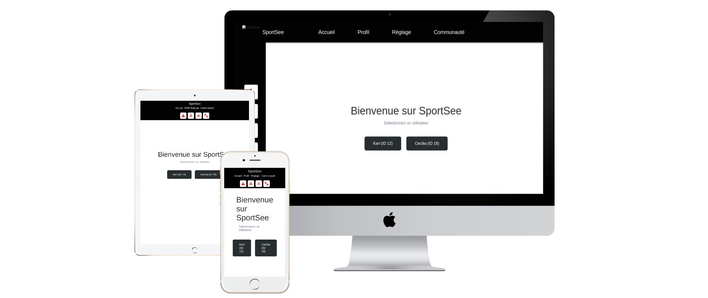

# SportSee — Tableau de Bord du Profil Utilisateur

**Languages:** [Français](README.fr.md) | [English](README.md)

[](https://react.dev)
[](https://www.typescriptlang.org)
[](https://nodejs.org)
[](https://vitejs.dev)
[](https://recharts.org)
[](LICENSE)
[](https://github.com)


Un tableau de bord moderne basé sur React pour afficher les données de fitness et d'activité des utilisateurs avec des graphiques interactifs construits avec Recharts.

## 📋 Présentation

SportSee est un tableau de bord de suivi des performances sportives qui affiche l'activité de l'utilisateur, les métriques de performance et les indicateurs de santé clés. Construit avec **React + TypeScript**, il offre la récupération de données en temps réel à partir d'une API backend Node.js.

### Périmètre Actuel
- ✅ Mise en page desktop (1024x780px minimum)
- ✅ 15 user stories implémentées
- ⏳ Versions mobiles et tablettes prévues pour le prochain sprint

## 🚀 Démarrage

### Prérequis
- Node.js 16+ et npm
- API backend en cours d'exécution (voir dossier `/Backend`)

### Installation

```bash
# Installer les dépendances
npm install

# Démarrer le serveur de développement
npm run dev

# Construire pour la production
npm run build

# Aperçu de la build production
npm run preview

# Lancer le linting
npm run lint
```

## 📁 Structure du Projet

```
src/
├── components/          # Composants React réutilisables
│   ├── Charts/         # Composants graphiques (BarChart, LineChart, RadarChart, RadialChart)
│   ├── Layout/         # Navigation et mise en page
│   └── MetricCard/     # Cartes de métriques clés
├── pages/              # Composants au niveau des pages
│   ├── Home/
│   └── Profile/        # Page du tableau de bord principal
├── client/             # Services clients API
│   ├── apiClient.ts    # Client HTTP utilisant Axios
│   ├── mockClient.ts   # Données de test pour le développement
│   └── builders.ts     # Transformateurs de données
├── data/               # Données de test
├── loaders/            # React Router loaders pour la récupération de données
├── types/              # Définitions de types TypeScript
├── constants/          # Constantes de l'application
└── helpers/            # Fonctions utilitaires
```

## 🎯 Fonctionnalités Clés (15 User Stories)

### Mise en Page et Navigation
- **US#1** : Barre de navigation horizontale avec liens (Accueil, Profil, Réglage, Communauté)
- **US#2** : Barre latérale verticale avec boutons de type d'activité
- **US#3** : Mise en page optimisée desktop (1024x780px minimum)

### Tableau de Bord Utilisateur
- **US#4** : Salutation personnalisée avec le prénom de l'utilisateur
- **US#5** : Informations utilisateur du endpoint `/user/:id`
- **US#10** : Cartes de métriques clés (Calories, Protéines, Glucides, Lipides)

### Récupération de Données
- **US#6** : Données d'activité quotidienne de `/user/:id/activity`
- **US#7** : Durée moyenne des sessions de `/user/:id/average-sessions`
- **US#8** : Score quotidien de `/user/:id`
- **US#9** : Métriques de performance de `/user/:id/performance`

### Graphiques et Visualisations
- **US#11** : BarChart — Activité quotidienne (poids et calories)
- **US#12** : LineChart — Tendance de la durée moyenne des sessions
- **US#13** : RadarChart — Performance par type d'activité
- **US#14** : RadialBarChart — Score de réalisation de l'objectif quotidien
- **US#15** : Cartes de métriques — Chiffres clés de santé avec icônes

## 🔌 Intégration API

### Sources de Données

L'application récupère les données à partir de 4 endpoints principaux :

```typescript
// Informations utilisateur
GET /user/:id
→ Retourne : userInfos, score/todayScore, keyData

// Activité quotidienne
GET /user/:id/activity
→ Retourne : sessions[] avec day, kilogram, calories

// Durée moyenne des sessions
GET /user/:id/average-sessions
→ Retourne : sessions[] avec day (1-7), sessionLength

// Données de performance
GET /user/:id/performance
→ Retourne : kind (1-6 mapping), data[] avec value et kind
```

### API Mockée vs Réelle

**Développement** — Utilise les données de test (`src/data/mockData.ts`) :
```bash
npm run dev
```

**Production** — Passe à l'API réelle via la configuration d'environnement dans `apiClient.ts`

### Normalisation des Données

Le client standardise les données avant leur consommation par les composants :
- Normalise le champ `score`/`todayScore` en un seul champ
- Formate les nombres (ex. 1930 → "1,930 kCal")
- Mappe les catégories de performance (cardio, énergie, endurance, force, vitesse, intensité)

## 📊 Composants Graphiques

### ActivityBarChart
Affiche le poids quotidien et la consommation de calories avec des barres à double axe.
- Axe Y gauche : Calories
- Axe Y droit : Poids (kg)
- Tooltip au survol avec les valeurs

### SessionLineChart
Affiche la tendance de la durée moyenne des sessions sur la semaine.
- Arrière-plan dégradé animé
- Ligne courbe avec effets au survol
- Indicateur de point de données blanc

### PerformanceRadarChart
Graphique radar à 6 axes affichant les performances par catégorie.
- Arrière-plan sombre
- Polygone rempli de rouge
- Étiquettes blanches pour chaque axe

### ScoreRadialChart
Indicateur de progression circulaire pour la réalisation de l'objectif quotidien.
- Arc rouge sur fond clair
- Pourcentage au centre
- Extrémités arrondies

## 🛠️ Directives de Développement

### Flux de Données
1. Le loader de route récupère les données à partir du client API/mock
2. Les composants reçoivent les données via `useLoaderData()`
3. Les données sont formatées et affichées dans les graphiques/cartes

### Ajouter de Nouvelles Fonctionnalités
- Créer des composants dans `src/components/`
- Utiliser `src/client/` pour les appels API (jamais directement depuis les composants)
- Définir les types dans `src/types/`

### Normes de Code
- Utiliser TypeScript pour la sécurité des types
- Les composants sont fonctionnels avec hooks
- Les styles organisés par composant

## 🔄 Modèles de Données

```typescript
// Données principales de l'utilisateur
UserMainData {
  userInfos: { firstName, lastName, age }
  score | todayScore: number (0-1)
  nutritionData: { calorieCount, proteinCount, carbohydrateCount, lipidCount }
}

// Sessions d'activité
ActivitySession {
  day: number | string
  kilogram: number
  calories: number
}

// Performance
PerformanceData {
  kind: Record<number, string>
  data: Array<{ value: number, kind: number }>
}
```

## 🌍 Support des Navigateurs

- Navigateurs modernes (ES2020+)
- Navigateurs desktop (Chrome, Firefox, Safari, Edge)

## 📝 Dépendances

### Core
- **React 18+** : Framework UI
- **React Router** : Routage côté client
- **TypeScript** : Typage statique

### Données & HTTP
- **Axios** : Client HTTP
- **Recharts** : Bibliothèque de visualisation de graphiques

### Build & Dev
- **Vite** : Outil de build et serveur de développement
- **ESLint** : Linting de code

## 📚 Scripts Disponibles

| Commande | Objectif |
|----------|----------|
| `npm run dev` | Démarrer le serveur de développement |
| `npm run build` | Construire pour la production |
| `npm run preview` | Aperçu de la build production |
| `npm run lint` | Exécuter ESLint |
| `npm run lint:fix` | Corriger les problèmes de linting |

## 🚀 Déploiement

Construire le bundle production :
```bash
npm run build
```

Le dossier `dist/` contient la build optimisée prête pour le déploiement.

## 📖 Prochaines Étapes

- Design responsive mobile et tablette (prochain sprint)
- Implémentations supplémentaires de user stories
- Optimisation des performances
- Tests E2E avec Playwright

## 📞 Support et Contribution

Pour des questions ou des problèmes, consultez les exigences du projet dans `.oc/Kanban.md` et les maquettes de conception dans `.oc/`.

---

**Construit avec ❤️ en utilisant React, TypeScript et Recharts**
